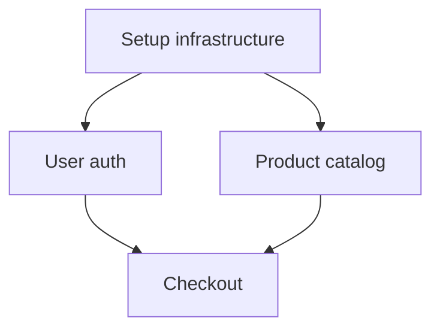

# Strategic Reasoning Loop

This skill generates structured Plan.md files with dependency tracking for complex projects and strategic initiatives.

## Quick Start

Generate a plan from a project description:

```bash
python scripts/generate_plan.py --input project_brief.md --output Plan.md
```

Or interactively:

```bash
python scripts/generate_plan.py --interactive
```

## Workflow

1. **Analyze objective**: Break down the high-level goal into concrete tasks
2. **Identify dependencies**: Determine which tasks must be completed before others
3. **Validate dependencies**: Check for circular dependencies and logical ordering
4. **Generate Plan.md**: Create structured plan with dependency graph
5. **Track progress**: Update task status and monitor completion

## Plan.md Structure

Generated plans follow this format:

```markdown
# Project Plan: [Project Name]

**Created**: 2026-02-19
**Status**: In Progress
**Owner**: [Owner Name]

## Objective

[Clear statement of what this plan aims to achieve]

## Success Criteria

- [ ] Criterion 1
- [ ] Criterion 2
- [ ] Criterion 3

## Tasks

### Task 1: [Task Name]
**ID**: T1
**Status**: pending
**Dependencies**: None
**Estimated Effort**: [Low/Medium/High]

[Detailed description of what needs to be done]

**Acceptance Criteria**:
- [ ] Specific deliverable 1
- [ ] Specific deliverable 2

---

### Task 2: [Task Name]
**ID**: T2
**Status**: pending
**Dependencies**: T1
**Estimated Effort**: Medium

[Description]

**Acceptance Criteria**:
- [ ] Deliverable

---

## Dependency Graph

```
T1 → T2 → T4
T1 → T3 → T4
T5 (independent)
```

## Timeline

**Phase 1**: T1, T5 (can run in parallel)
**Phase 2**: T2, T3 (after T1 completes)
**Phase 3**: T4 (after T2 and T3 complete)

## Notes

[Additional context, assumptions, or considerations]
```

## Features

### Dependency Tracking

Tasks can depend on one or multiple other tasks:

```yaml
tasks:
  - id: T1
    name: "Setup development environment"
    dependencies: []

  - id: T2
    name: "Implement authentication"
    dependencies: [T1]

  - id: T3
    name: "Create database schema"
    dependencies: [T1]

  - id: T4
    name: "Build user dashboard"
    dependencies: [T2, T3]
```

### Dependency Validation

The script automatically:
- Detects circular dependencies
- Validates that all referenced dependencies exist
- Identifies tasks that can run in parallel
- Calculates critical path

### Status Tracking

Track task progress:
- `pending` - Not started
- `in_progress` - Currently being worked on
- `blocked` - Waiting on dependencies
- `completed` - Finished
- `cancelled` - No longer needed

### Effort Estimation

Categorize tasks by effort:
- `Low` - Quick tasks (< 1 day)
- `Medium` - Standard tasks (1-3 days)
- `High` - Complex tasks (> 3 days)

## Input Formats

### YAML Input

```yaml
project:
  name: "E-commerce Platform"
  objective: "Build a scalable e-commerce platform"
  owner: "Development Team"

success_criteria:
  - "Platform handles 10k concurrent users"
  - "Payment processing is secure and compliant"
  - "Admin dashboard is fully functional"

tasks:
  - id: T1
    name: "Setup infrastructure"
    description: "Configure cloud hosting, databases, and CI/CD"
    dependencies: []
    effort: Medium

  - id: T2
    name: "Implement user authentication"
    description: "OAuth, JWT, password reset, 2FA"
    dependencies: [T1]
    effort: High

  - id: T3
    name: "Build product catalog"
    description: "Product CRUD, categories, search, filters"
    dependencies: [T1]
    effort: High
```

### Markdown Input

Provide a project brief in markdown:

```markdown
# E-commerce Platform Project

## Goal
Build a scalable e-commerce platform that handles 10k concurrent users.

## Key Requirements
- User authentication with OAuth and 2FA
- Product catalog with search and filters
- Shopping cart and checkout
- Payment processing (Stripe integration)
- Admin dashboard for inventory management
- Order tracking and notifications

## Constraints
- Must launch in 3 months
- Budget: $50k
- Team: 3 developers
```

The script will analyze and generate a structured plan with dependencies.

## Advanced Usage

### Update Existing Plan

```bash
python scripts/generate_plan.py --update Plan.md --task T2 --status completed
```

### Visualize Dependencies

```bash
python scripts/generate_plan.py --input Plan.md --visualize --output dependency_graph.png
```

### Check for Blockers

```bash
python scripts/generate_plan.py --input Plan.md --check-blockers
```

Shows which tasks are blocked and why.

### Calculate Critical Path

```bash
python scripts/generate_plan.py --input Plan.md --critical-path
```

Identifies the longest sequence of dependent tasks.

### Export to JSON

```bash
python scripts/generate_plan.py --input Plan.md --export-json --output plan.json
```

## Integration with Vault

When used with a vault system:

1. Place project briefs in `/Needs_Action`
2. Run strategic_reasoning_loop to generate Plan.md
3. Move Plan.md to `/Pending_Approval` for review
4. After approval, move to `/Approved` for execution
5. Track progress and update task statuses
6. Move completed plans to `/Done`

## Dependency Patterns

### Sequential Dependencies

```
T1 → T2 → T3 → T4
```

Each task must complete before the next starts.

### Parallel with Convergence

```
T1 → T2 ↘
         T4
T1 → T3 ↗
```

T2 and T3 can run in parallel after T1, both must complete before T4.

### Independent Streams

```
T1 → T2 → T3
T4 → T5 → T6
```

Two independent task chains that can run simultaneously.

### Diamond Pattern

```
    T1
   ↙  ↘
  T2   T3
   ↘  ↙
    T4
```

Common pattern where parallel tasks converge.

## Error Handling

The script detects and reports:

- **Circular dependencies**: T1 → T2 → T3 → T1
- **Missing dependencies**: T2 depends on T5 which doesn't exist
- **Orphaned tasks**: Tasks with no path to completion
- **Invalid status transitions**: Can't mark task as completed if dependencies aren't done

## Best Practices

1. **Keep tasks atomic**: Each task should be a single, well-defined unit of work
2. **Clear acceptance criteria**: Define what "done" means for each task
3. **Realistic effort estimates**: Be honest about complexity
4. **Document assumptions**: Note any dependencies on external factors
5. **Regular updates**: Keep task statuses current
6. **Review dependencies**: Ensure logical ordering makes sense
7. **Identify parallel work**: Maximize efficiency by finding tasks that can run concurrently

## Examples

For detailed examples of different project types, see [references/plan-examples.md](references/plan-examples.md).

For dependency pattern templates, see [references/dependency-patterns.md](references/dependency-patterns.md).

## Output Formats

### Markdown (default)
Human-readable plan with full details.

### JSON
Structured data for programmatic access:
```json
{
  "project": {
    "name": "E-commerce Platform",
    "status": "in_progress"
  },
  "tasks": [
    {
      "id": "T1",
      "name": "Setup infrastructure",
      "status": "completed",
      "dependencies": []
    }
  ],
  "dependency_graph": {...}
}
```

### YAML
Configuration-friendly format for version control.

### Mermaid Diagram
Visual dependency graph:

